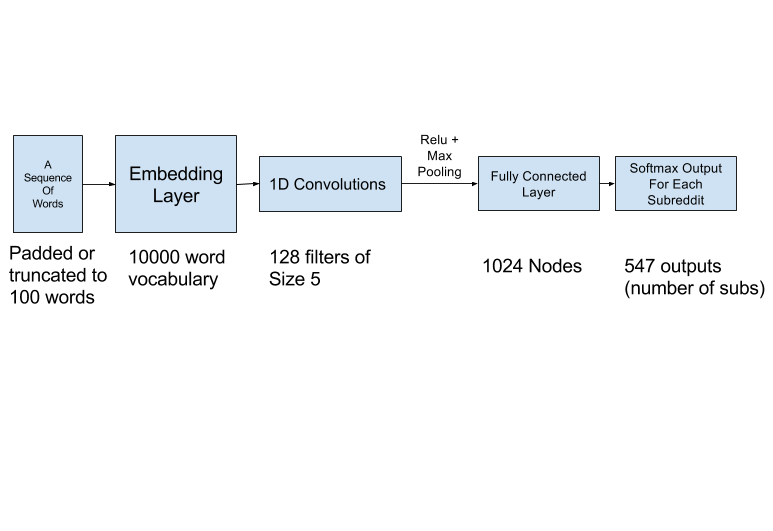

# Reddit2Vec: Subreddit Recommendation

## Capstone project for the Galvanize Data Science Immersive program

## Project Goals:
The goal of this project is to give recommendations on reddit content (in the form of subreddits to follow) based on the kind of content a user already enjoys. In this project that will take the form of a web page where a user will input their Twitter handle and receive recommendations for subreddits to follow based on that data. Additionally a user will be able to provide the text of some content they enjoy and find which subreddits it best belongs in. While the scope of this project is limited to reddit I feel that the approach I have taken here could be extended to any text based content aggregator or social network.

The recommender system built in this project has been implemented at [www.findsubreddits.com](www.findsubreddits.com)

## Methods:
I began by getting data from the 100 top posts(or as many as there were) of around 600 popular subreddits. This data came in the form of titles, text from within text posts and comments. After pulling data from the reddit API I had around 3 million reddit commnents, titles and posts from which to draw text data from.

Initially I explored the concept of mapping each comment to a vector using the method described in [A Simple But Tough-To-Beat Baseline For Sentence Embeddings](https://openreview.net/pdf?id=SyK00v5xx) by treating each entire comment as a sentence. Using this technique I built a recommender that took some text and found the subreddits with the most similar average sentence vectors, and recommended them (the SBT_Recommender). However this recommender was very slow to make predictions and had a lot of variance in the quality of the predictions depending on what kind of text was submitted. This did yield some interesting insights into how related various subreddits were when I did K-Means clustering on each subreddits sentence vector, so I knew the data I had could be used to differentiate subreddits based on topic.

In order to train a classifier I first featurized the text using word2vec embeddings. I tried training embeddings on my own corpus using [gensim](https://radimrehurek.com/gensim/models/word2vec.html) and also using embeddings from the [Stanford GloVe project](https://nlp.stanford.edu/projects/glove/). To make all the comments the same length I padded/truncated them to be 100 word tokens long.

After mapping each word to an embedding vector I used these to train a convolutional neural network (loosely based on the structure in [this](https://blog.keras.io/using-pre-trained-word-embeddings-in-a-keras-model.html) article) to classify comments/titles into the proper subreddit. Using this classifier I can take some content that a user presumably likes and find which subreddits it would likely be found in. Using this I can make recommendations on which subs are similar to their interests.

### Current Model:

The current model for the recommender is a convolutional neural network with one convolutional layer of 128 size 5 filters followed by max pooling and one fully connected layer of 1024 nodes before the softmax output layer. This model will likely need to be adapted as I scale the system up to a greater number of subreddits.

### Future Work:
* Improve web interface and clean up the css
* Collect data on more subreddits and expand the pool for recommendations
* Experiment with neural net structure

#### Libraries  and Technologies Used
* Tweepy
    * Twitter API wrapper for python
* pymongo
* PRAW
    * reddit API wrapper for python
* Gensim
* Beautiful Soup
* GloVe word embeddings
    * https://nlp.stanford.edu/projects/glove/
* The following articles and repositories:
    * https://github.com/adventuresinML/adventures-in-ml-code
    * https://github.com/tensorflow/models/blob/master/tutorials/embedding/word2vec.py
    * https://github.com/keras-team/keras/blob/master/examples/pretrained_word_embeddings.py

 
 
 

